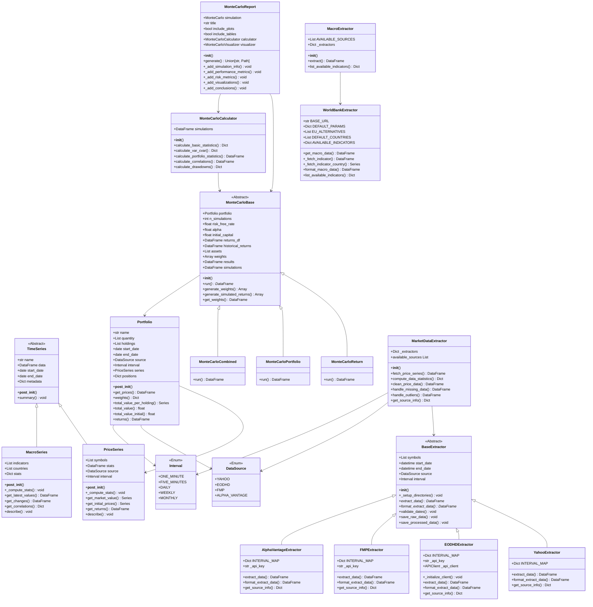

# 🏗️ System Architecture

## Class Diagram



## Key Design Patterns

- **Template Method**: MonteCarloBase, BaseExtractor
- **Strategy**: Multiple data sources and simulation types  
- **Factory**: MarketDataExtractor creates specific extractors
- **Facade**: Portfolio and MarketDataExtractor simplify complex operations
- **Observer**: Automatic statistics updates
- **Adapter**: API format standardization
```
