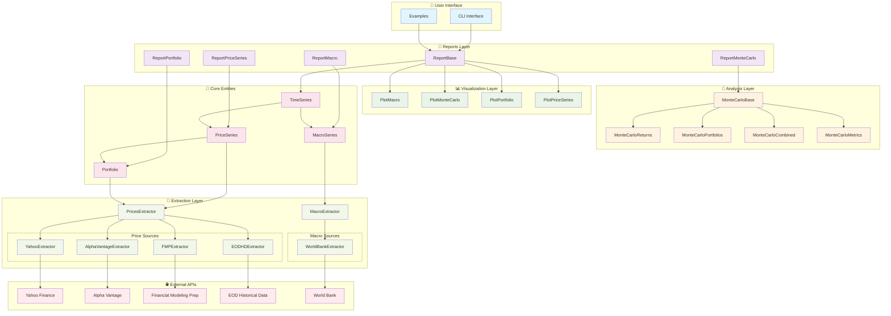
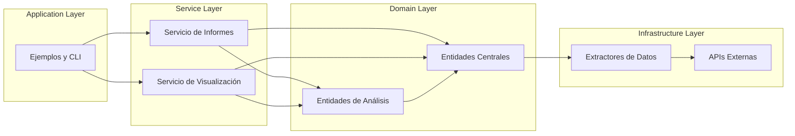
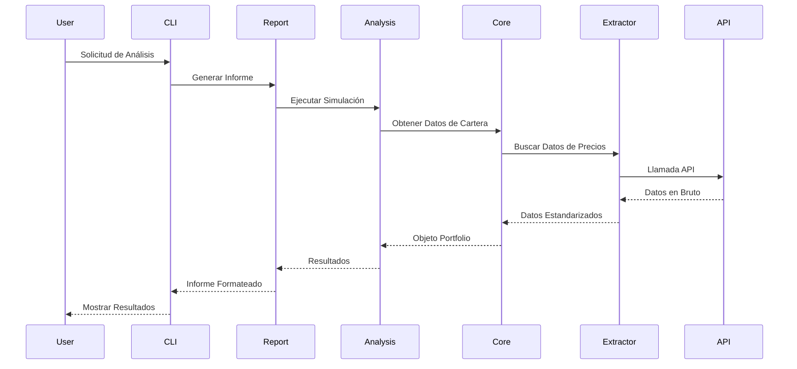
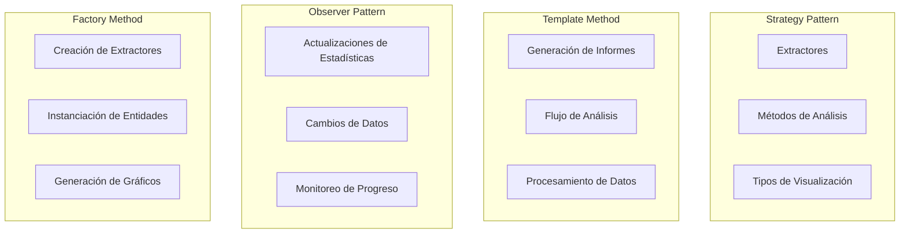
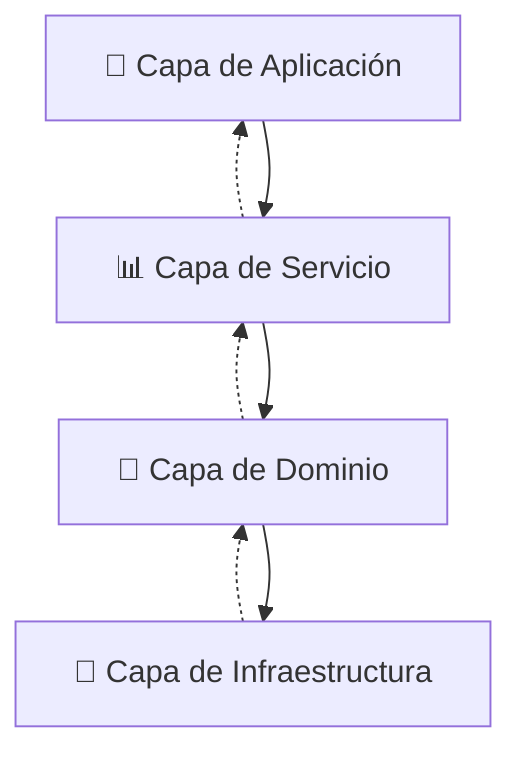

# 🎨 Diagramas de la Arquitectura

## 📊 Diagrama de Clases Principal (Mermaid)

## 🏗️ Diagrama de Componentes

## 🔄 Diagrama de Flujo de Datos

## 🎯 Patrones de Diseño por Módulo

## 📊 Dependencias Entre Capas

