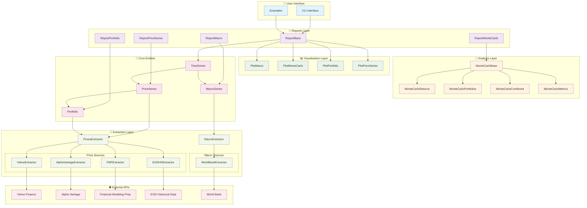
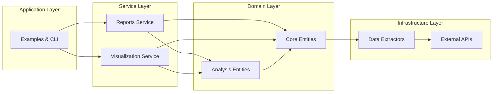
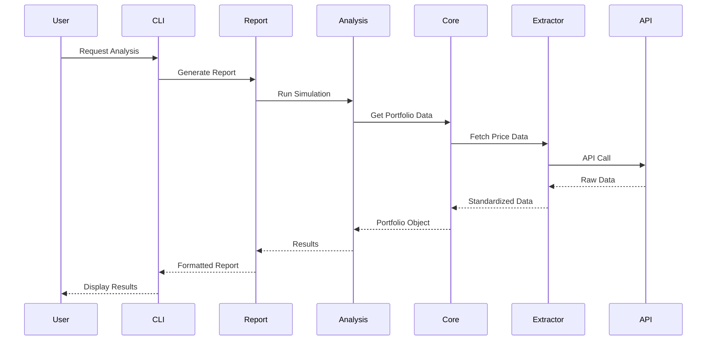
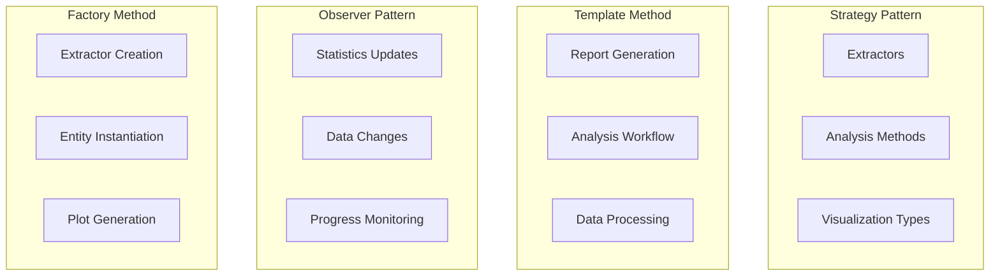
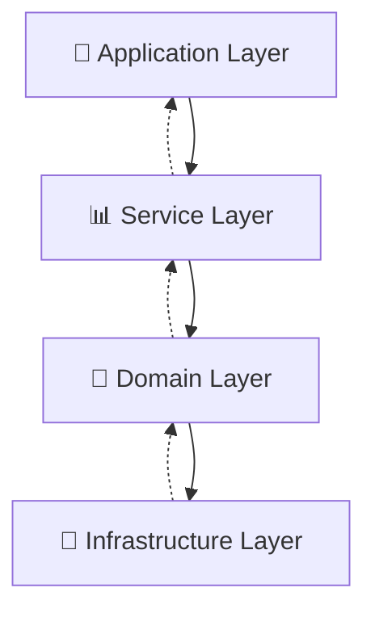

# 🎨 Diagramas da Arquitetura

## 📊 Diagrama de Classes Principal (Mermaid)

## 🏗️ Diagrama de Componentes

## 🔄 Diagrama de Fluxo de Dados

## 🎯 Padrões de Design por Módulo

## 📊 Dependências Entre Camadas

